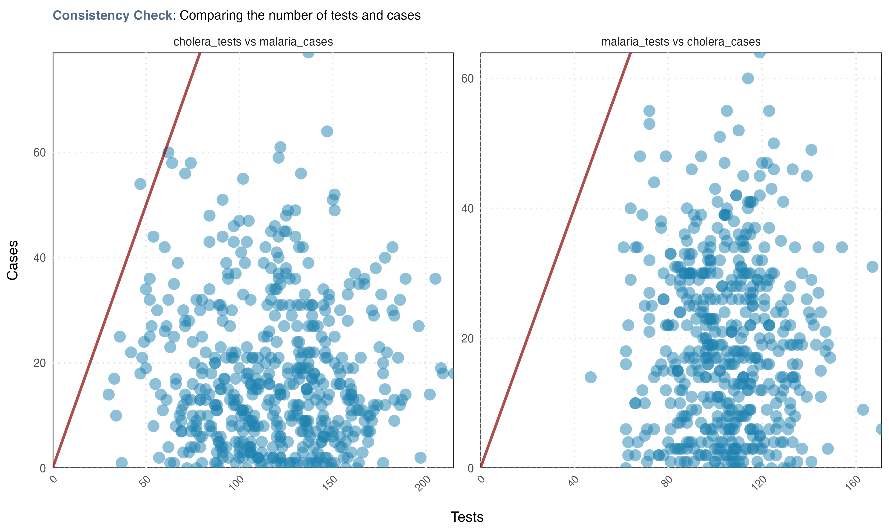
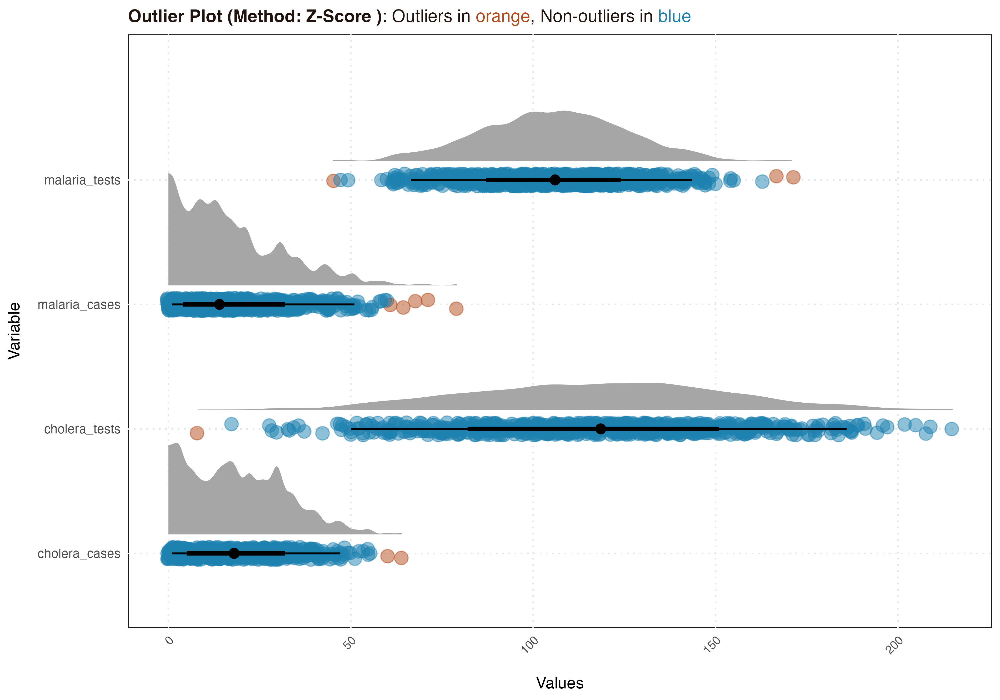

# epiCleanr 

<!-- badges: start -->
[](https://github.com/truenomad/epicleanr/actions)
[](https://www.codefactor.io/repository/github/truenomad/epicleanr)
[](https://codecov.io/gh/truenomad/epiCleanr?branch=main)

## Description 

**epiCleanr** offers a tidy solution for epidemiological data. It houses a range
of functions for epidemiologists and public health data wizards for data 
management and cleaning. These include:

- `import()` imports files of any formats.
- `export()` exports files of any formats.
- `get_admin_names()` downloads admin names using various country codes and naming conventions.
- `clean_admin_names()` cleans admin names using both user-provided and downloaded admin data.
- `create_test()` creates a unit test functions to perform various data validation.
- `consistency_check()` plot to see certain variables exceed others (i.e., tests vs cases).
- `handling_outliers()` detects outliers using various approaches, and offers functionality to manage outliers in a number of ways.
- `missing_plot()` plots missing data or reporting rate for given variable(s) by different factors.


## Installation ##

The package is available on 
[CRAN](http://cran.r-project.org/web/packages/epiCleanr/) and can be installed 
directly in R using:

```R
install.packages("epiCleanr")
```

You can install the latest development version from GitHub by using:

```R
# If you haven't installed the 'devtools' package, run:
# install.packages("devtools")
devtools::install_github("truenomad/epiCleanr")
```

## Usage

### Import and export

Inspired by `rio`, the import function allows you to read data from a wide 
range of file formats. Additional reading options specific to each format can 
be passed through the ellipsis (...) argument. Similarly, the export function 
provides a simple way to export data into various formats.

```R
# Load the epiCleanr package
library(epiCleanr)

# Reading a CSV file with a specific seperator
data_csv <- import("path/to/your/file.csv", sep = "\n")

# Import the first sheet from an Excel file
data_excel <- import("path/to/your/file.xlsx", sheet = 1)

# Export a Stata DTA file
export(my_data, "path/to/your/file.dta")

# Export an RDS file
export(my_data, "path/to/your/file.rds")

# Export an Excel file with sheets
export(
list(my_data = my_data1, my_data2 = my_data2), "path/to/your/file.xlsx")
```

### Download administrative names

You can download administrative names (such as districts, provinces, etc.,) for 
a given country via the `GeoNames` website using country name or codes. 

```R
admin_names <- get_admin_names(country_name_or_code = "Togo")

# different admin levels are saved as a list
str(admin_names$adm2)

#>'data.frame':	30 obs. of  7 variables:
#> $ country_code  : chr  "TG" "TG" "TG" "TG" ...
#> $ asciiname     : chr  "Vo Prefecture" "Zio Prefecture" "Tchaoudjo" "Tchamba" ...
#> $ alternatenames: chr  "Circonscription de Vogan, Prefecture de Vo, Préfecture de Vo, ...
#> $ adm2          : chr  "Vo Prefecture" "Zio Prefecture" "Tchaoudjo" "Tchamba" ...
#> $ latitude      : num  6.42 6.58 9 8.83 6.67 ...
#> $ longitude     : num  1.5 1.17 1.17 1.42 1.5 ...
#> $ last_updated  : IDate, format: "2019-01-08" "2019-01-08" "2022-02-17" "2022-02-17" ...
```

### Clean administrative names

You can clean administrative names using them `clean_admin_names` function, 
which use various matching and string distance algorithms to match you admin 
data using your own provided data and admin names data from `GeoNames`.

```R
# get simulated data
data(fake_epi_df_togo)
# referecne dataset with clean admin names
data(togo_admin_df) 

# lets check how the matching looks 
clean_admin_names(
     country_code = "Togo",
     admin_names_to_clean = fake_epi_df_togo$district,  
     user_base_admin_names = togo_admin_df$district, 
     report_mode = T) 

#> There are 15 out of 15 (100%) admins that have been perfectly matched!
#>   # A tibble: 15 × 5
#>  names_to_clean  final_names     ource_of_cleaned_name       prop_matched  matching_algorithm  
#>    <chr>         <chr>           <chr>                         <dbl>       <chr>               
#>  1 Bas-Mono      Bas-Mono        User base admin names         100         Levenshtein Distance
#>  2 Bliita        Blitta          Main admin name from geodata  100         Soundex             
#>  3 Centrale      Centrale        User base admin names         100         Levenshtein Distance
#>  4 Cinkaasi      Cinkassé        User base admin names         100         Soundex             
#>  5 Dankben       Dankpen         Main admin name from geodata  100         Soundex             
#>  6 East-Mono     Est-Mono        Main admin name from geodata  100         Soundex             
#>  7 Kaloto        Kloto           Main admin name from geodata  100         Soundex             
#>  8 Keéran        Keran           Alternative name from geodata 100         Soundex             
#>  9 Lomé          Lomé            User base admin names         100         Levenshtein Distance
#> 10 Ogou          Ogou            Main admin name from geodata  100         Levenshtein Distance
#> 11 Sotouboua     Sotouboua       Main admin name from geodata  100         Levenshtein Distance
#> 12 Tchamaba      Tchamba         Main admin name from geodata  100         Soundex             
#> 13 Vo            Vo Prefecture   Main admin name from geodata  100         Levenshtein Distance
#> 14 Yotto         Yoto            Main admin name from geodata  100         Soundex    
#> 15 Zioo          Zio Prefecture  Main admin name from geodata  100         Soundex         

# If we are happy with the names, we can update the old names with the new ones
# Otherwise we can further clean the names manually
fake_epi_df_togo$district <- 
clean_admin_names(
        country_code = "Togo",
        admin_names_to_clean = fake_epi_df_togo$district, 
        user_base_admin_names = togo_admin_df$district, 
        report_mode = F) 
```

### Create unit testing functions

The `create_test` exists to help user create their function in which they can 
use for unit testing when working datasets that require lots of manipulation and
wrangling. This function plus the `tidylog` package will save the headache of 
of troubleshooting issues related to data joins and transformations.

```R
# set up a unit-testing fucntion
my_tests <- create_test(
        # for dimension of data
        dimension_test = c(900, 9), 
        # for expected numer of cominations in data
        combinations_test = list(
        variables = c("month", "year", "district"),
        expectation = 12 * 5 * 15),
        # repeated cols, rows and max and min thresholds
        row_duplicates = TRUE, col_duplicates = TRUE,
        max_threshold_test = list(malaria_tests = 1000, cholera_tests = 1000),
        min_threshold_test = list(cholera_cases = 0, cholera_cases = 0)
        )

# apply your test on your data
my_tests(fake_epi_df_togo)

#> Test passed! You have the correct number of dimensions!
#> Test passed! No duplicate rows found!
#> Test passed! No repeated columns found!
#> Test passed! You have the correct number of combinations for month, year, district!
#> Test passed! Values in column cholera_cases are above the threshold.
#> Test passed! Values in column cholera_cases are above the threshold.
#> Test passed! Values in column malaria_tests are below the threshold.
#> Test passed! Values in column cholera_tests are below the threshold.

#> Congratulations! All tests passed: 8/8 (100%) 😀
```

### Consistency check

The `consistency_check` function serves as a quick tool for validating the logical 
relationships between variables. For instance, if you know that the number of 
cases cannot exceed the number of tests conducted, this function helps confirm 
such expected behaviours in your data.

```R
consistency_check(fake_epi_df_togo, 
                  tests = c("malaria_tests", "cholera_tests"),
                  cases = c("cholera_cases", "malaria_cases"))

#> Consistency test passed for malaria_tests vs cholera_cases: There are more tests than there are cases!
#> Consistency test failed for cholera_tests vs malaria_cases: There are 3 (0.33%) rows where cases are greater than tests.                  
                  
```




### Detecting and handling outliers

The `handle_outliers` function is designed for both identifying and addressing 
outliers in your dataset. It supports multiple statistical methods for outlier 
detection, such as Z-score, modified Z-score, and Interquartile Range. Beyond 
detection, the function offers various options for handling outliers, including
removal or replacement with mean, median, grouped means, or quantiles. 

```R
data("fake_epi_df_togo")

# select the variables
variables <- c("malaria_tests", "malaria_cases",
               "cholera_tests", "cholera_cases")

# get outliers report
outliers <- handle_outliers(
    fake_epi_df_togo, vars = variables,
    method = "zscore", report_mode = TRUE)

# get the report
outliers$report

#>   variable      test    outliers prop_outliers
#>   <chr>         <chr>   <glue>   <chr>        
#> 1 malaria_tests Z-Score 5/900    <1%          
#> 2 malaria_cases Z-Score 5/900    <1%          
#> 3 cholera_tests Z-Score 2/900    <1%          
#> 4 cholera_cases Z-Score 1/900    <1%          

# get the plot
outliers$plot

# you can even save it if you want
# ggplot2::ggsave("images/outliers_plot.png", width = 10, 
#                height = 7, scale = 0.95, dpi = 400)

# if happy, create a dataframe with the outliers handled 
fake_epi_df_togo_no_outliers <- handle_outliers(
                                       fake_epi_df_togo, vars = variables, 
                                       method = "zscore", report_mode = FALSE, 
                                       treat_method = "mean")

```



### Checking missing data and reporting rates over factors

The `missing_plot` function allows you to visualize missing data across 
different variables, either by a single factor like time or district, or by 
two factors simultaneously like date and district. This is particularly useful 
when you're dealing with epidemiological data that might have varying degrees 
of completeness across different times or locations.

```R
# make date columns
fake_epi_df_togo2 <- fake_epi_df_togo |> 
   dplyr::mutate(date = lubridate::as_date(paste0(year, month, "/01")))  

# Missing rate for variables across dates
missing_plot(fake_epi_df_togo2, miss_vars = variables, 
              x_var = "date", use_rep_rate = F)

```


```R
# Reporting rate for malaria_cases across dates and districts
missing_plot(fake_epi_df_togo2, miss_vars = "malaria_cases", 
              x_var = "date", y_var = "district", use_rep_rate = T)
```

